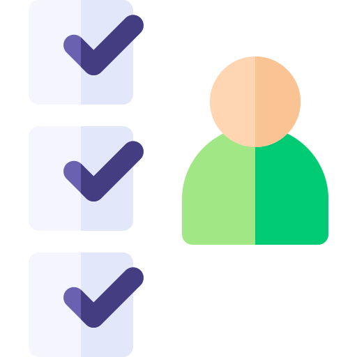

<p align="center">

</p>

# Ejecutar en Desarrollo
1. Clonar el repositorio
2. Ejecutar
```
npm install
```
3. Tener Nest CLI instalado
```
npm i -g @nest/cli
```
4. Tener creada y levantada la Base de datos Mongo
5. Renombra el archivo __.env.example.__ a __.env__
6. Llenar las variables de entorno definidas en __.env__ (si no cuenta con usuario y contraseña en la DB no las ponga)
7. Cambiar nombre del proyecto. En el archivo "package.json", en la propiedad "name", poner el nuevo nombre y tambien renombrar la carpeta del proyecto
 
8. Ejecutar la aplicación en dev:
```
npm run start:dev
```
9. Revisar la documentación en: 
```
localhost:3000/api
```

## Ejecutar pruebas e2e
```
npm run test:e2e
```
